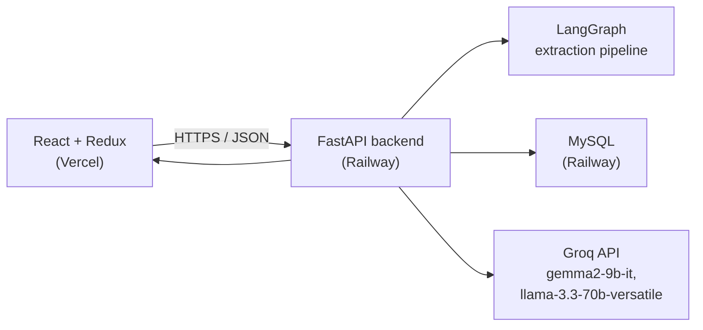

# Pharma QMS — AI-Powered Customer Complaint Management System

An AI-assisted complaint intake system for a pharmaceutical Quality Management System (QMS). A reviewer
pastes or uploads a customer complaint (email, PDF, DOCX, EML) and an AI pipeline extracts structured
fields, flags data-completeness gaps, classifies risk, summarizes the complaint, and checks for likely
duplicates — auto-populating a QMS-style intake form for human review.

**Live app:** https://pharma-assist-ai-ten.vercel.app
**Backend API:** https://pharmaassistai-production.up.railway.app/docs

---

## Architecture



**Why this split:** frontend and backend are deployed independently (Vercel + Railway) rather than as a
monolith, so each can scale/redeploy on its own and the setup mirrors how a real product team would run
this. CORS is configured explicitly on the backend to allow the deployed frontend origin.

---

## The AI pipeline

The core of the system is a LangGraph `StateGraph` (`backend/app/agents/graph.py`) with four sequential
nodes, run every time a complaint document/text is submitted:

1. **`extract_fields`** — calls Groq `gemma2-9b-it` with a strict JSON-extraction prompt to pull structured
   fields (product, batch/lot, dates, complaint type, severity, etc.) out of raw complaint text.
2. **`check_completeness`** — flags which required QMS fields are missing or null *(bonus: Complaint
   Completeness Checker)*.
3. **`classify_risk`** — calls Groq `llama-3.3-70b-versatile` (a stronger reasoning model, deliberately
   swapped in here since risk judgment benefits from more reasoning capacity than raw extraction does) to
   assign a Critical/High/Medium/Low risk level with a rationale, informed by ICH Q9-style thinking
   *(bonus: AI Risk Classification)*.
4. **`summarize`** — produces a 2-3 sentence QA-reviewer summary *(bonus: Complaint Summary)*.

**Duplicate detection** (`backend/app/agents/duplicate.py`) is intentionally *not* an LLM call — it's a
plain DB query matching existing complaints on `batch_lot_number` + `product_name`. This was a deliberate
design choice: those two fields are the strongest, cheapest signal for "same underlying quality event,"
and reaching for an LLM here would add cost and latency without meaningfully improving accuracy for a demo
scope. The code notes how this would be extended with embedding similarity over `detailed_description` in
a production version.

**The AI Copilot chat** (`backend/app/agents/copilot.py`) is a separate, simpler call — grounded only in
the currently loaded complaint's data, so it can't hallucinate facts about complaints it hasn't been shown.

---

## Bonus features implemented (4 of 6 listed in the brief)

| Feature | Implemented | Where |
|---|---|---|
| Complaint Completeness Checker | ✅ | `check_completeness` node |
| AI Risk Classification | ✅ | `classify_risk` node |
| Complaint Summary | ✅ | `summarize` node |
| Duplicate Complaint Detection | ✅ | `duplicate.py` (DB-level match) |
| Root Cause Recommendation | ❌ not built | — |
| CAPA Recommendation | ❌ not built | — |

---

## Design decisions worth knowing (for the interview)

- **MySQL over Postgres** — the assignment allows either; MySQL was chosen to match. IDs are stored as
  `CHAR(36)` (Python-generated UUID strings) since MySQL has no native UUID column type.
- **Sequential graph, not parallel** — the four LangGraph nodes run in a strict sequence rather than in
  parallel, because `classify_risk` and `summarize` both read the *output* of `extract_fields`, not the raw
  text — so they're genuinely dependent, not just conveniently ordered.
- **Two different Groq models, not one** — `gemma2-9b-it` for structured extraction (fast, cheap, good
  enough for a well-specified JSON schema) and `llama-3.3-70b-versatile` specifically for risk
  classification (a judgment call that benefits from more reasoning capacity).
- **CORS configured via `pydantic-settings`, not hardcoded** — `cors_allowed_origins` /
  `cors_allowed_origin_regex` live in `config.py` so new frontend origins can be allow-listed via
  environment variables without a code change or redeploy.

---

## Tech stack

| Layer | Technology |
|---|---|
| Frontend | React 18, Redux Toolkit, Vite |
| Backend | Python, FastAPI |
| AI orchestration | LangGraph |
| LLMs | Groq — `gemma2-9b-it`, `llama-3.3-70b-versatile` |
| Database | MySQL (SQLAlchemy ORM) |
| Frontend hosting | Vercel |
| Backend + DB hosting | Railway |
| Font | Google Inter |

---

## Local setup

### Backend

```bash
cd aivoa-complaint-system/backend
python3 -m venv venv
source venv/bin/activate        # Windows: venv\Scripts\activate
pip install -r requirements.txt

cp .env.example .env
# edit .env — add your GROQ_API_KEY (free at console.groq.com) and a MySQL DATABASE_URL
```

Local MySQL via Docker:
```bash
docker run --name aivoa-mysql -e MYSQL_ROOT_PASSWORD=root -e MYSQL_DATABASE=aivoa_complaints -p 3306:3306 -d mysql:8.0
```

Run:
```bash
uvicorn app.main:app --reload --port 8000
```
Swagger docs at `http://localhost:8000/docs`.

### Frontend

```bash
cd aivoa-complaint-system/frontend
npm install
cp .env.example .env
# set VITE_API_BASE_URL to your backend URL
npm run dev
```
Opens at `http://localhost:5173`.

---

## API reference

| Method | Path | Purpose |
|---|---|---|
| `POST` | `/api/complaints/extract` | Extract fields from pasted text |
| `POST` | `/api/complaints/extract-file` | Extract fields from an uploaded PDF/DOCX/TXT/EML |
| `POST` | `/api/complaints` | Save a (reviewed) complaint |
| `GET` | `/api/complaints` | List all complaints |
| `GET` | `/api/complaints/{id}` | Get one complaint |
| `PUT` | `/api/complaints/{id}` | Update a complaint |
| `POST` | `/api/complaints/chat` | AI Copilot chat, grounded in a complaint's data |
| `GET` | `/health` | Health check |

Full interactive docs: `/docs` (Swagger UI, auto-generated by FastAPI).

---

## Known limitations

- Duplicate detection is a simple field match, not semantic similarity — noted above as a deliberate
  scope decision, but worth naming as a limitation too.
- Root Cause Recommendation and CAPA Recommendation bonus features are not implemented.
- Production-grade OCR is intentionally out of scope per the assignment brief.

---

<div align="center">


<br/>

### VISHAL KUMAR
*AI/ML Enthusiast &nbsp;·&nbsp; Full-Stack Learner &nbsp;·&nbsp; Building Technology with Purpose*

<br/>

[](https://github.com/Kumarvishal01971)
[](https://www.linkedin.com/in/kumarvishal01971-w222b/)
&nbsp;&nbsp;
[](https://pharma-assist-ai-ten.vercel.app/)

<br/><br/>


<br/>

*If this project helped you understand AI-assisted QMS workflows — a* ⭐ *on GitHub means the world.*

[](https://github.com/kumarvishal01971/Pharma_assist_AI)

</div>